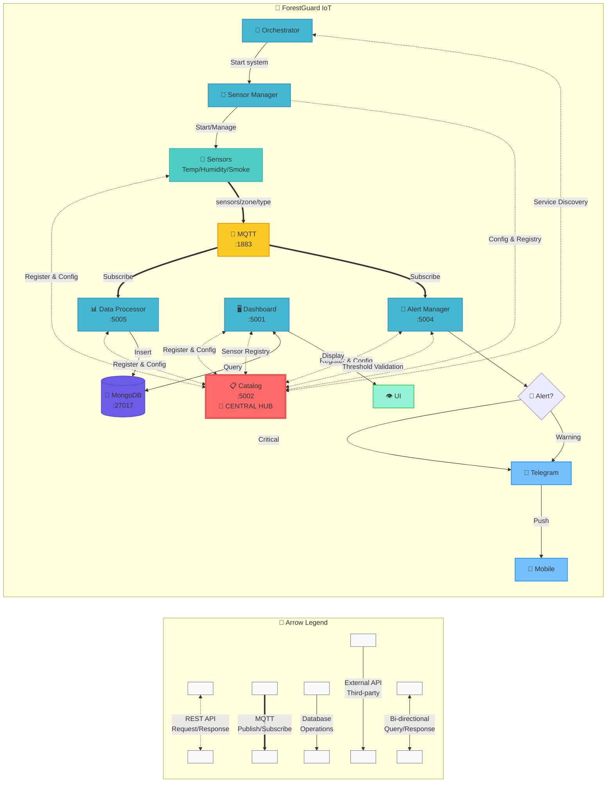

# ForestGuard IoT System Architecture

```mermaid
---
config:
  layout: dagre
---
flowchart LR
 subgraph Legend["🔗 Arrow Legend"]
    direction TB
        L2[" "]
        L1[" "]
        L4[" "]
        L3[" "]
        L6[" "]
        L5[" "]
        L8[" "]
        L7[" "]
        L10[" "]
        L9[" "]
  end
 subgraph Main["🌲 ForestGuard IoT"]
        ORCH["🎯 Orchestrator"]
        SMGR["🦾 Sensor Manager"]
        B["🔬 Sensors<br>Temp/Humidity/Smoke"]
        C["📋 Catalog<br>:5002<br>🎯 CENTRAL HUB"]
        E["📡 MQTT<br>:1883"]
        H["📊 Data Processor<br>:5005"]
        I["🚨 Alert Manager<br>:5004"]
        Q["🖥️ Dashboard<br>:5001"]
        J[("📄 MongoDB<br>:27017")]
        P["💬 Telegram"]
        R["👁️ UI"]
        S["📱 Mobile"]
        L{"🎯 Alert?"}
  end
    L1 <-. REST API<br>Request/Response .-> L2
    L3 == MQTT<br>Publish/Subscribe ==> L4
    L5 -- Database<br>Operations --> L6
    L7 -- "External API<br>Third-party" ---> L8
    L9 <-- "Bi-directional<br>Query/Response" --> L10
    ORCH -- Start system --> SMGR
    SMGR -- Start/Manage --> B
    B <-. Register & Config .-> C
    SMGR -. Config & Registry .-> C
    H <-. Register & Config .-> C
    I <-. Register & Config .-> C
    Q <-. Register & Config .-> C
    ORCH <-. Service Discovery .-> C
    I <-. Threshold Validation .-> C
    Q <-. Sensor Registry .-> C
    B == sensors/zone/type ==> E
    E == Subscribe ==> H & I
    H -- Insert --> J
    I --> L
    L -- Critical --> P
    L -- Warning --> P
    Q <-- Query --> J
    Q -- Display --> R
    P -- Push ---> S
     L2:::legendStyle
     L1:::legendStyle
     L4:::legendStyle
     L3:::legendStyle
     L6:::legendStyle
     L5:::legendStyle
     L8:::legendStyle
     L7:::legendStyle
     L10:::legendStyle
     L9:::legendStyle
     ORCH:::serviceStyle
     SMGR:::serviceStyle
     B:::sensorStyle
     C:::catalogStyle
     E:::mqttStyle
     H:::serviceStyle
     I:::serviceStyle
     Q:::serviceStyle
     J:::storageStyle
     P:::externalStyle
     R:::outputStyle
     S:::externalStyle
    classDef catalogStyle fill:#ff6b6b,stroke:#e55656,stroke-width:4px
    classDef sensorStyle fill:#4ecdc4,stroke:#3db7b8,stroke-width:2px
    classDef serviceStyle fill:#45b7d1,stroke:#3a9bc1,stroke-width:2px
    classDef mqttStyle fill:#f9ca24,stroke:#f39c12,stroke-width:2px
    classDef storageStyle fill:#6c5ce7,stroke:#5a4fcf,stroke-width:2px
    classDef outputStyle fill:#96f2d7,stroke:#51cf66,stroke-width:2px
    classDef externalStyle fill:#74c0fc,stroke:#339af0,stroke-width:2px
    classDef legendStyle fill:#f8f9fa,stroke:#6c757d,stroke-width:1px,color:transparent
```
